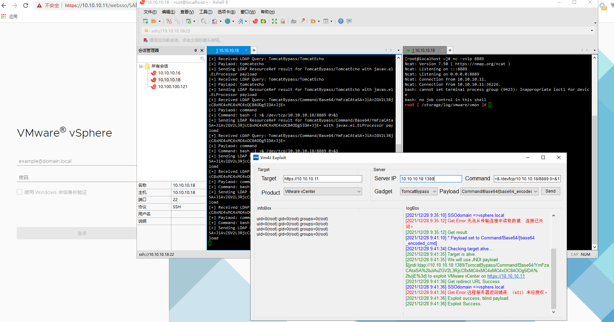

# Vm4J
A tool for detect vmware product log4j vulnerability.

# How it works?

- First start a `JNDIExploit` server.

- Start this tool and set any config to right setting.
- Send payload.

# Screenshot

# Note

1. This project use `Visual Studio 2022` and `.NET Framework 4.5`.
2. For Debug mode this tool set proxy to `127.0.0.1:8080` and Release mode set proxy to `null`.
3. Some Product **CAN USE DNSLOG ONLY **.

# Todo

- Workspace One.
